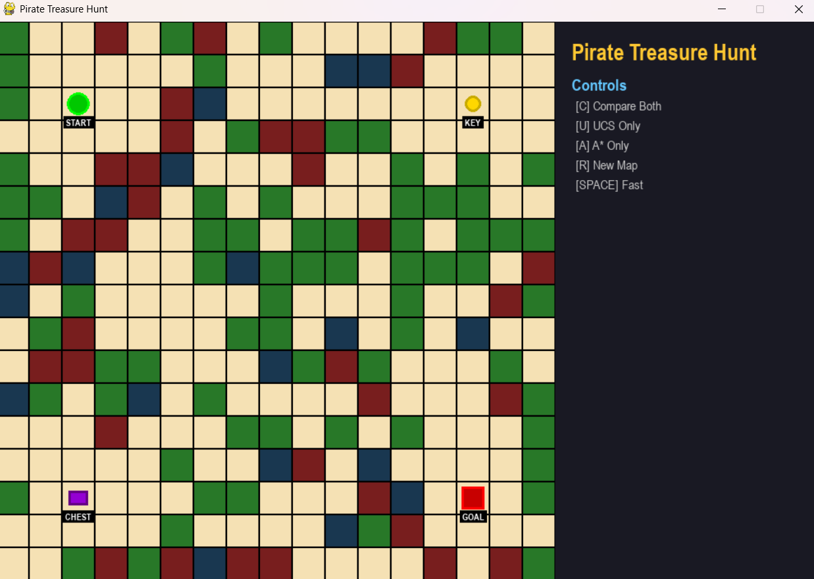

# Pirate Treasure Hunt – UCS vs A* Search

This project is a visual and interactive comparison of Uniform Cost Search (UCS) and A* search, built with Python and Pygame.
Both algorithms solve the same pathfinding problem, allowing direct comparison of efficiency while guaranteeing optimal solutions.

## Problem Overview

A pirate navigates a grid-based island to:
1. Start at the ship
2. Collect a key
3. Use the key to unlock a treasure chest
4. Reach the goal with the treasure

The environment contains multiple terrain types with different movement costs and obstacles.

**Terrain and Costs**

- *Sand* (yellow) – cost 1
- *Jungle* (green) – cost 5
- *Lake* (blue) – cost 10
- *Lava* (red) – impassable

Maps are procedurally generated, but critical locations are cleared to ensure solvability.

## Algorithms Compared
**Uniform Cost Search (UCS)**
- Expands nodes in order of cumulative path cost
- Guarantees optimal paths
- Explores a large portion of the state space

**A\* Search**
- Uses UCS + an admissible heuristic
- Heuristic estimates remaining cost based on distance to key, chest, and goal
- Guarantees optimal paths while expanding fewer nodes

Both algorithms always return the same optimal path cost, but differ in efficiency.

## Visualization Features

- Real-time exploration and frontier visualization
- Animated final path traversal
- Sidebar with:
  - Expanded node counts
  - Path cost
  - Percentage efficiency improvement of A* over UCS
- Controls:
  - **U** – Run UCS
  - **A** – Run A*
  - **C** – Compare UCS then A* on the same map
  - **R** – Generate a new random map
  - **SPACE** – Toggle fast (turbo) execution

## Project Structure
```
.
├── main.py              # Visualization and game loop
├── algorithms.py        # UCS and A* implementations
├── heuristic.py         # Heuristic for A*
└── README.md
```

## How to Run
```bash
git clone https://github.com/Markl1T/ucs-vs-astar-pathfinding.git
cd usc-vs-astar-pathfinding
pip install -r requirements.txt
python main.py
```

## Screenshots

